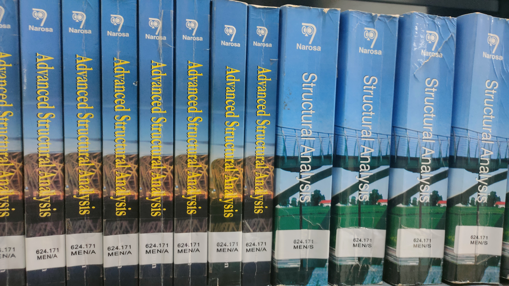
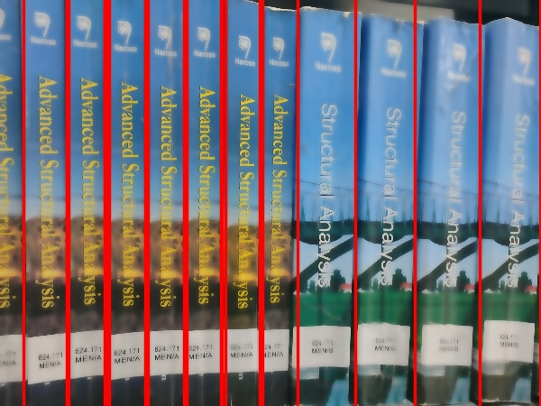

# oelp

  
   
  

input (book 11 in dataset)
&nbsp;&nbsp;&nbsp;&nbsp;&nbsp;&nbsp;&nbsp;&nbsp;&nbsp;&nbsp;&nbsp;&nbsp;&nbsp;&nbsp;&nbsp;&nbsp;&nbsp;&nbsp;&nbsp;&nbsp;&nbsp;&nbsp;&nbsp;&nbsp;&nbsp;&nbsp;&nbsp;&nbsp;&nbsp;&nbsp;&nbsp;&nbsp;&nbsp;&nbsp;&nbsp;&nbsp;&nbsp;&nbsp;&nbsp;&nbsp;&nbsp;&nbsp;&nbsp;&nbsp;&nbsp;&nbsp;&nbsp;&nbsp;&nbsp;&nbsp;&nbsp;&nbsp;&nbsp;&nbsp;&nbsp;&nbsp;&nbsp;&nbsp;&nbsp;&nbsp;&nbsp;&nbsp;&nbsp;&nbsp;&nbsp;&nbsp;&nbsp;&nbsp;&nbsp;&nbsp;&nbsp;&nbsp;&nbsp;&nbsp;&nbsp;&nbsp;&nbsp;&nbsp;&nbsp;&nbsp;&nbsp;&nbsp;&nbsp;&nbsp;&nbsp;&nbsp;&nbsp;&nbsp;&nbsp;&nbsp;&nbsp;&nbsp;&nbsp;&nbsp;&nbsp;&nbsp;&nbsp;&nbsp;&nbsp;&nbsp;&nbsp;&nbsp;&nbsp;&nbsp;&nbsp;&nbsp;&nbsp;&nbsp;&nbsp;&nbsp;&nbsp;&nbsp;&nbsp;&nbsp;&nbsp;&nbsp;&nbsp;&nbsp;&nbsp;&nbsp;&nbsp;&nbsp;&nbsp;&nbsp;&nbsp;output(spines of book 11 in data set)

<h2>Background and Challenges:</h2>
<h3 color: blue;>
A System has already been made which comprises two parts, the hardware and the software. Hardware is basically a robot which has been developed to take the images of the books (from the side view) and the software part is to identify which book it is based on the images using programming tools like neural networks, Matlab, python or OpenCV. The challenge is to improve the system in such a way that it can be applied in sections with a very large dataset. Currently there is only one camera on the robot which makes it time consuming to take images of all the layers in the book shelf at once. 
</h3>
<h2>Deliverables:</h2>
<h3 color: blue;>
	To upgrade the given hardware for efficiency.
	To optimize the software to map the images with less energy and time consumption
</h3>
<h2>Methodology:</h2>
<h3 color: blue;>
For the hardware part we can try using multiple cameras situated at different heights depending on the height of each shelf in the book shelf, or use a single motorized attached to an antenna like rod that can be adjusted according to the heights and also if books are in consecutive sides then the motor could also rotate to take the images of the shelf on the back side.
For the software part we can apply CNN and use multiclass classification to identify the book from the database. But for that we need to have an image and database of each of the books and its code beforehand. One approach can be to add the tensor values of an image horizontally and defending upon the range of the tensor values near the part where the book code is present design a NN to crop out that part and then apply image processing to give the book code as the output, finally to match with the code already present in the database.
</h3>
